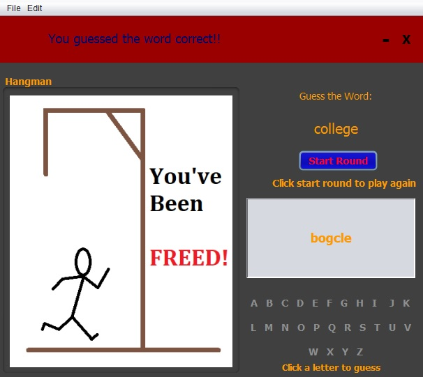

# HangmanGUI 

A simple hangman GUI made in Java AWT/swing. Rotates through different images for each letter that is missed until the game is over and the user has been hung in game.
The game displays the entire Alphabet for the user to click on to make a guess along with the a textField to show the missed guesses. The word that is trying to be guessed
is displayed with astericks until a correct letter is guessed then the asterick is replaced by the letter. 

## Example Output

## Notes

## Authors

 **Anthony Tennenbaum** 

## License

This project is licensed under the MIT License - see the [LICENSE.md](LICENSE.md) file for details

