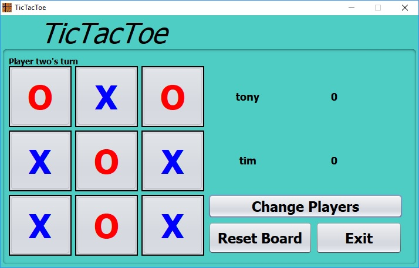

# TicTacToe Java AWT/swing

This is a simple TicTacToe GUI, that allows players to enter their names and keep track of who wins and the total number of games they won.
The players can reset points and names when ever they need to by simple buttons.
The player can simply reset the board after each game or when need arises by clicking a button.

## Example Output

 

## Notes

If the player decides to click cancel instead of choosing a name it will automaticly give the name
of either Player 1 or Player 2. The board does not reset after each round until th player clicks the
reset board button.

## Authors

**Anthony Tennenbaum** 

## License

This project is licensed under the MIT License - see the [LICENSE.md](LICENSE.md) file for details
