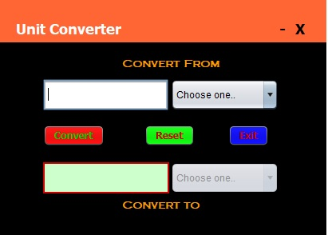
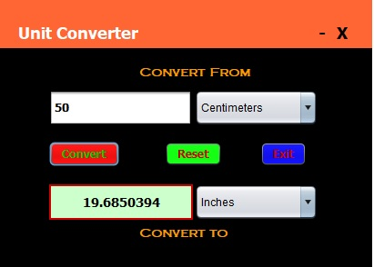
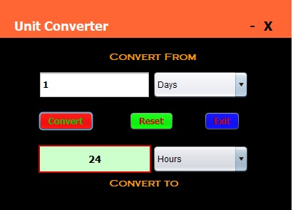

# Unit Converter

A basic Unit Converter that will convert time and length units.

## Example Output

This image will display as your example output. Name the image README.jpg in your project folder.

## Notes

## Authors

**Anthony Tennenbaum** 

## License

This project is licensed under the MIT License - see the [LICENSE.md](LICENSE.md) file for details
